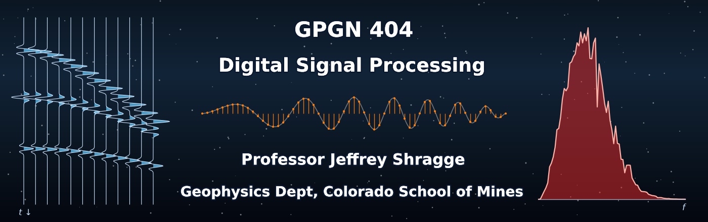

# GPGN 404: Digital Signal Processing

Course notes for GPGN 404 at the Colorado School of Mines, taught by Professor Jeffrey Shragge. These Jupyter notebooks are the course
textbook: each module develops the theory alongside reproducible Python examples that use NumPy, SciPy and Matplotlib, applied to
geophysical data.

## Getting the notes

Clone the repository into the folder where you want the notes:

    git clone --depth 1 https://github.com/jshragge/CSM_GP_DIGSIG_2026.git

The `--depth 1` option downloads only the current version of the notes (about 13 MB) rather than the full history.
To get updates during the semester, run `git pull` inside the `CSM_GP_DIGSIG_2026` folder.

## Setting up the `dsp2026` Python environment

The notebooks need Python 3.12 with `numpy`, `scipy`, `matplotlib`, `pandas`, `sympy`, `ipywidgets` and JupyterLab. The file
`environment.yml` in this repository lists them all. The recommended setup is a dedicated conda environment called `dsp2026`:

1. Install [Miniforge](https://github.com/conda-forge/miniforge) (or Anaconda/Miniconda) if you do not already have conda.
2. From the folder you cloned, create the environment (this only needs to be done once):

       cd CSM_GP_DIGSIG_2026
       conda env create -f environment.yml

3. Register the environment as a Jupyter kernel (also once):

       conda activate dsp2026
       python -m ipykernel install --user --name dsp2026 --display-name "Python (dsp2026)"

4. Start JupyterLab from the activated environment:

       conda activate dsp2026
       jupyter lab

5. Open a notebook and make sure the kernel name in the top-right corner is **Python (dsp2026)**. If it says anything else
   (for example plain "Python 3"), choose **Kernel → Change Kernel… → Python (dsp2026)**. In VS Code, pick the same kernel with
   **Select Kernel**.

<b>Troubleshooting:</b> an error such as `ModuleNotFoundError: No module named 'pandas'` (or `sympy`) almost always means the notebook is
running on a different Python than `dsp2026`, not that the package is missing. Switch the kernel to **Python (dsp2026)** as in step 5.
An animation that shows a blank image with play controls means Jupyter has not yet trusted the notebook's saved output: run the
animation's cell (or the whole notebook) once and it will play.

The notebooks are stored without their outputs to keep the repository small, so run each one (**Run → Run All Cells**)
to generate its figures, animations and audio. To slim notebooks again after running them (for example before committing),
use `python clean_notebooks.py`.

If the environment ever gets out of date with `environment.yml`, update it with `conda env update -f environment.yml --prune`.
Without conda, the same packages can be installed with pip:

    pip install numpy scipy matplotlib pandas sympy ipywidgets jupyterlab

Optional reference texts: A. V. Oppenheim and R. W. Schafer, *Discrete-Time Signal Processing*, 3rd ed.; S. W. Smith, *The Scientist and
Engineer's Guide to Digital Signal Processing*, 2nd ed. ([free online](http://www.dspguide.com/pdfbook.htm)); J. M. Kinder and P. Nelson,
*A Student's Guide to Python for Physical Modeling*.

# Course Outline

This introductory course on geophysical digital signal processing covers a lot of fundamental mathematical and numerical topics that you will need in your career as a geophysicist or more broadly when playing a quantitative role in the physical sciences.

### Module 01 - Introduction

The purpose of this module is to emphasize how fundamental DSP has been to your instructor in his career, and to highlight the key topics that will be investigated in this course.

### Module 02 - Signals, Systems and Processing

This short module introduces the vocabulary used throughout the course: signals; continuous, discrete and digital signals; systems; and processing.

### Module 03 - Complex Numbers

This module provides a refresher on the manipulation of complex numbers and functions, which are fundamental building blocks for the material developed later on in the course.

### Module 04 - Fourier Series

This module starts to build up the Fourier machinery by examining continuous, periodic time series. We calculate Fourier spectra that are a very helpful tool for examining signals in a different light.

### Module 05 - 1D Fourier Transforms

In this module we examine both the analytical and numerical properties of the 1D Fourier transform of continuous (non-periodic) time series. We also look at the Fourier transforms of a number of important analytic signals, as well as those of instrument responses, earthquake recordings and seismic data.

### Module 06 - 2D Fourier Transforms

This module extends the 1D Fourier analysis presented in Module 5 to 2D images. Concepts of 2D spatial filtering are introduced. We investigate the wavenumber structure of 2D magnetic and gravity data sets.

### Module 07 - LTI Systems, Convolution and Correlation

This module introduces the concepts of linear time-invariant (LTI) systems, including the operations of convolution, correlation, autocorrelation and deconvolution.

### Module 08 - Signals as Vectors, Systems as Matrices: the SVD

This module writes a sampled signal as a vector and a linear system as a matrix. The singular value decomposition (SVD) then shows what a system amplifies, what it loses, and why deconvolution can be unstable. Applications include the pseudo-inverse, low-rank image compression, and SVD filtering of seismic data. No linear algebra beyond matrix–vector products is assumed.

### Module 09 - Discrete-Time Signals

This module introduces a number of important concepts regarding discrete time series including: continuous vs discrete vs digital signals; deterministic vs stochastic signals; and characteristics of LTI systems.

### Module 10 - Digital Sampling and Reconstruction

This module explores the key consequences of performing digital sampling (i.e., aliasing), discusses strategies to avoid aliasing, and how to reconstruct analog signals from properly sampled time series.

### Module 11 - Discrete Fourier Transform

This module looks at how we can take 1D/2D Fourier transforms that we defined in a continuous fashion in the modules above and looks at how they can be posed in discrete systems, including the frequency axis of the DFT and spectral leakage.

### Module 12 - Windows and Spectrograms

This module looks at how we can go beyond Fourier transforms that span the entire time series to those that provide more information on the "local" frequency information.

### Module 13 - Wavelet Transforms

This module extends the time–frequency analysis of Module 12 with wavelets: the continuous wavelet transform, with scalograms of a chirp and of the 2011 Tohoku earthquake record, and the discrete Haar wavelet transform as a pair of filters. Applications are denoising and the compression of 1D signals and 2D images.

### Module 14 - Z-Transform

This module extends the discrete-time Fourier transform from the unit circle to the whole complex plane, giving the algebra used to design and analyze digital filters.

### Module 15 - Practical Filtering

We finish the course by looking at how Z-transforms can be used to set up FIR and IIR filters that can be used to do a whole bunch of useful things such as lowpass, highpass, bandpass and bandreject filtering of 1D signals.
